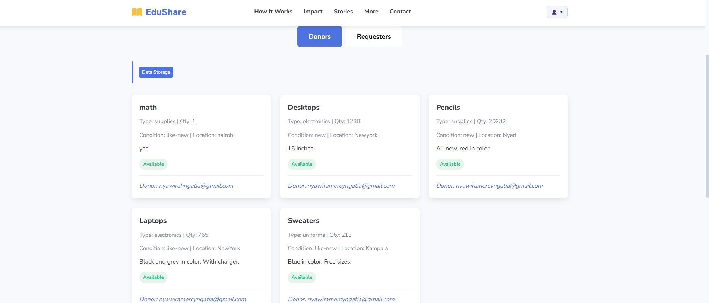

# EduShare - Educational Resource Sharing Platform

EduShare is a web-based platform that connects donors with educational organizations in need of resources, creating a powerful network for educational impact worldwide.

## Live Demo

🌐 [Visit EduShare Website](https://edushare-share.netlify.app/)  
📑 [View Project Presentation](https://ngatia.my.canva.site/edusharepresentation)

## Screenshots

### Home Page


### How it works Page


### Impact Page


### Testimonies Page


### Donation Form


### Community Directory


> 💡 Place your screenshots inside a `screenshots/` folder in your project, then update the paths above.

## Features

- **User Authentication**: Sign up as a donor or recipient
- **Resource Donation**: List educational materials for donation
- **Resource Requests**: Submit requests for needed educational resources
- **Impact Tracking**: View statistics on resources shared and environmental impact
- **Community Directory**: Browse donors and requesters in the community
- **Responsive Design**: Works on desktop, tablet, and mobile devices

## Technologies Used

- **Frontend**: HTML5, CSS3, JavaScript (ES6+)
- **Styling**: Custom CSS with Flexbox and Grid layouts
- **Icons**: Font Awesome
- **Fonts**: Google Fonts (Nunito)
- **Data Storage**: Browser Local Storage
- **No External Dependencies**: Everything works client-side

## Project Structure

```

EduShare/
├── index.html          # Main HTML file with all content
├── css/
│   └── style.css       # All CSS styles
├── js/
│   └── script.js       # All JavaScript functionality
└── screenshots/        # Images for README

````

## Setup Instructions

1. **Clone or Download the Project**
   ```bash
   git clone <repository-url>
   cd EduShare
````

2. **Run the Application**

   * Open `index.html` in a web browser
   * No server required - works directly in the browser

3. **Using the Platform**

   * Click "Get Started" to create an account as a donor or recipient
   * Donors can list items for donation
   * Recipients can submit requests for resources
   * Browse the community page to see available donations and requests

## Data Storage

EduShare uses the browser's Local Storage to persist:

* User accounts and authentication
* Donation listings
* Resource requests
* Impact statistics

All data remains in your browser and is not sent to any external server.

## Browser Compatibility

This application works in all modern browsers that support:

* ES6 JavaScript features
* CSS Flexbox and Grid
* Local Storage API

## Customization

You can customize EduShare by modifying:

* Colors in the `:root` CSS variables
* Content in the HTML file
* Form fields in the JavaScript code
* Styling in the CSS section

## Future Enhancements

Potential improvements for EduShare:

* Backend integration for persistent data storage
* Image upload and management
* Email notifications
* Geolocation features for finding nearby resources
* Admin dashboard for managing content

## License

This project is open source and available under the MIT License.

## Contact

For questions about this project, please contact:

* Email: [hello@edushare.org](mailto:hello@edushare.org)
* Phone: +1 (555) 123-4567

---

**EduShare** - Share Resources, Transform Lives

```


